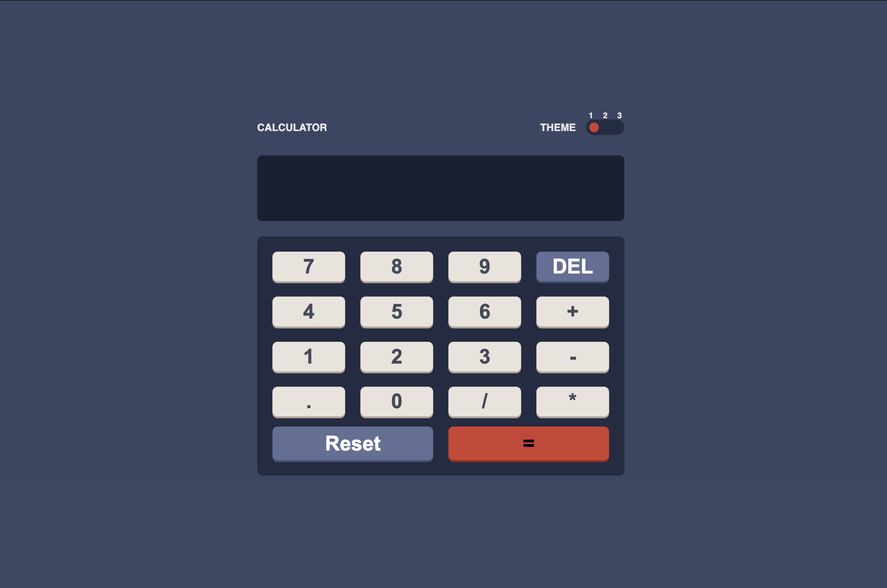
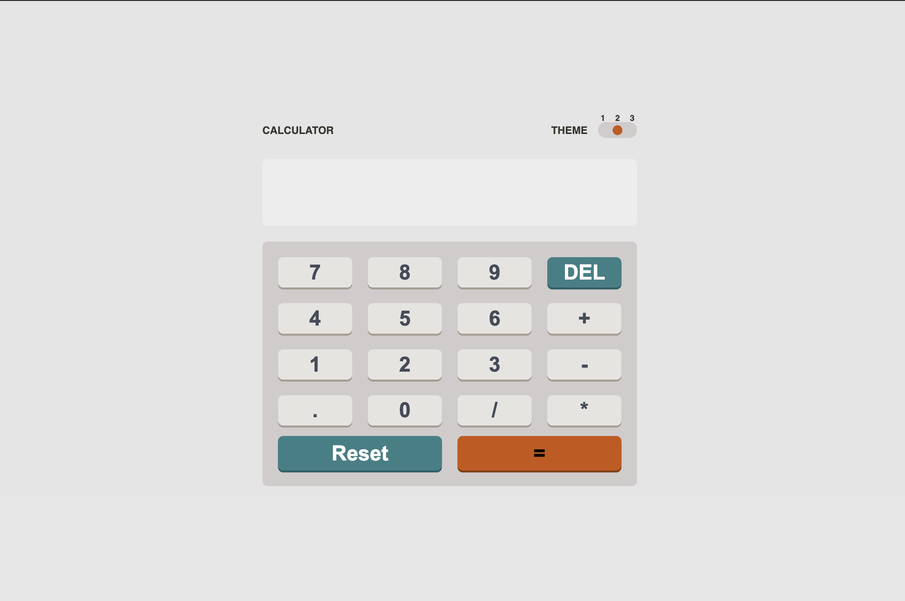
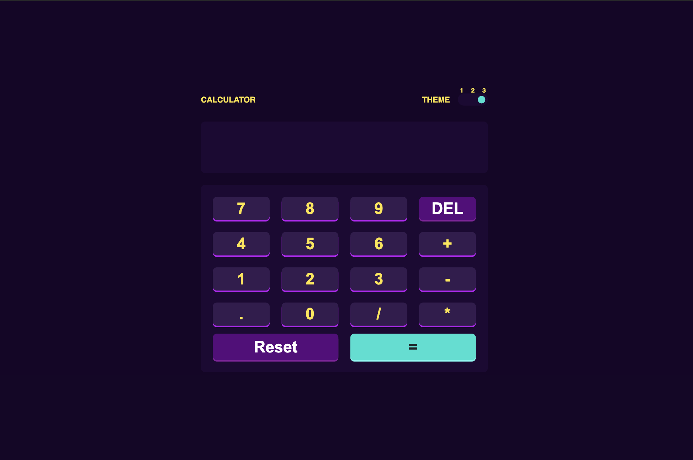
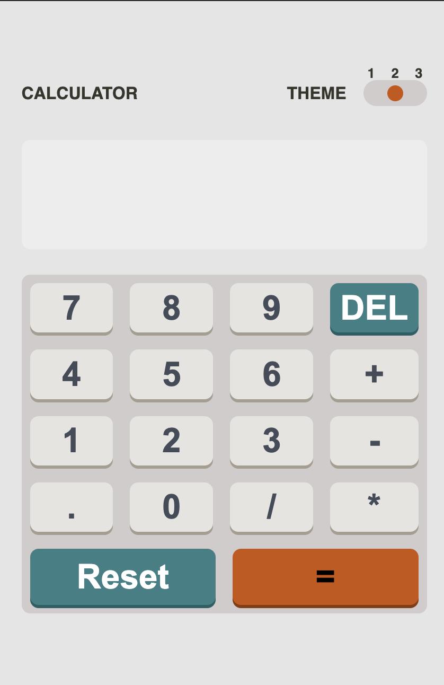
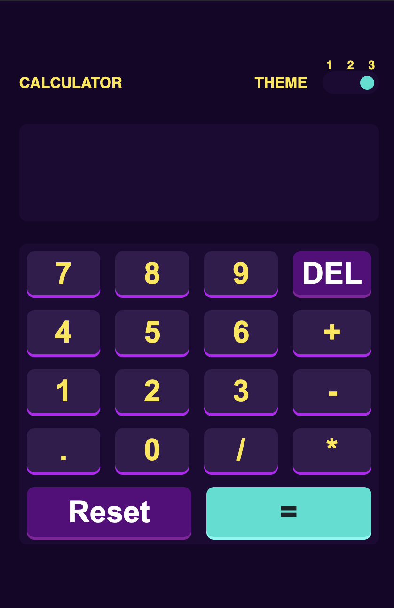

# Frontend Mentor - Calculator app solution

This is a solution to the [Calculator app challenge on Frontend Mentor](https://www.frontendmentor.io/challenges/calculator-app-9lteq5N29). Frontend Mentor challenges help you improve your coding skills by building realistic projects.

## Table of contents

- [Overview](#overview)
  - [The challenge](#the-challenge)
  - [Screenshot](#screenshot)
  - [Links](#links)
- [My process](#my-process)
  - [Built with](#built-with)
  - [What I learned](#what-i-learned)
- [Author](#author)
- [Acknowledgments](#acknowledgments)

## Overview

### The challenge

Users should be able to:

- See the size of the elements adjust based on their device's screen size
- Perform mathmatical operations like addition, subtraction, multiplication, and division
- Adjust the color theme based on their preference
- **Bonus**: Have their initial theme preference checked using `prefers-color-scheme` and have any additional changes saved in the browser

### Screenshot

### Links

- Solution URL: [https://github.com/YusufAkilevi/Frontend-Mentor-Calculator-App](https://github.com/YusufAkilevi/Frontend-Mentor-Calculator-App)
- Live Site URL: [Add live site URL here](https://your-live-site-url.com)

## My process

### Built with

- Semantic HTML5 markup
- CSS custom properties
- Flexbox
- CSS Grid
- Desktop-first workflow
- [React](https://reactjs.org/) - JS library

### What I learned

I built a theme switcher for the first time. I learned how to do that.

## Author

- Frontend Mentor - [@YusufAkilevi](https://www.frontendmentor.io/profile/YusufAkilevi)
- Twitter - [@yusufakilevii](https://twitter.com/yusufakilevii)
- GitHub - [@YusufAkilevi](https://github.com/YusufAkilevi)

## Acknowledgments

I worked alone in this project and I hope I would have an opportunity to work on an open source project with other developers.
